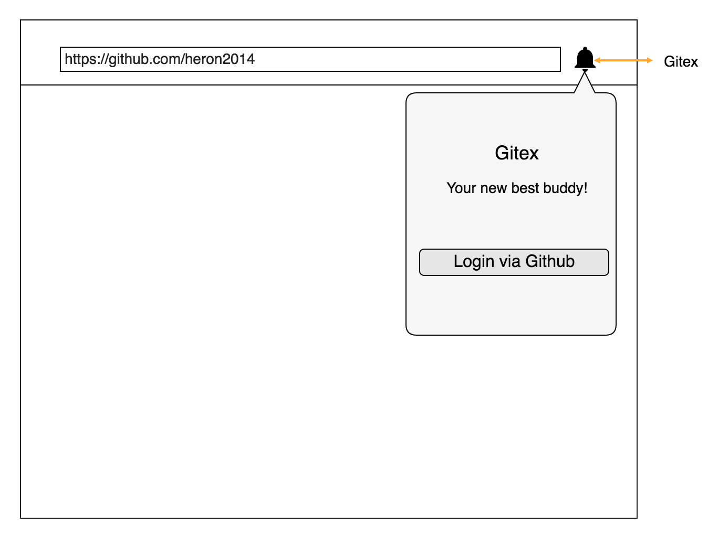
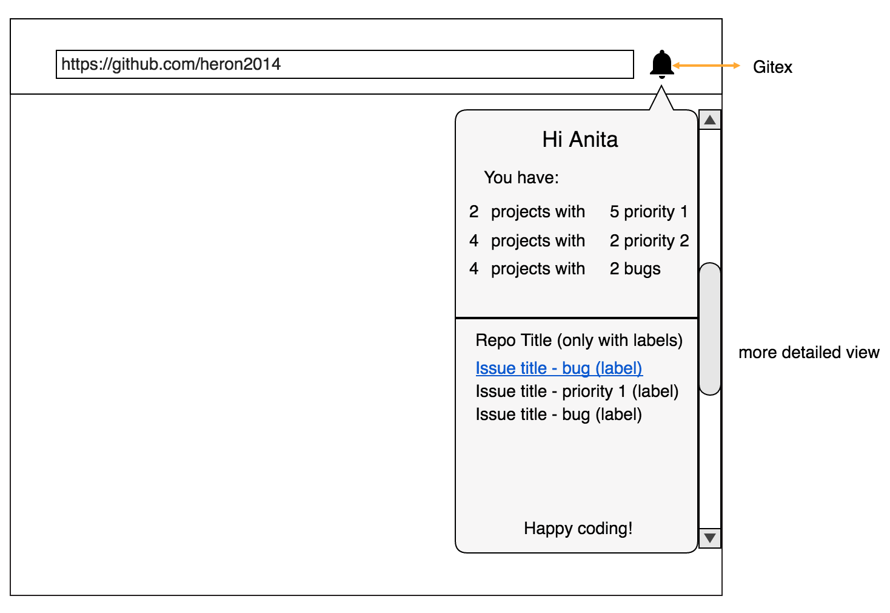

# Coming soon!

## What

Gitex is the Chrome extension that organise and summarise your Github issues based on the labels.

## Why

Working on couple of projects at the same time? Having lots of open issues with different labels? You know the story...

So, Gitex will tell you all about it under one or two clicks!

## Road Map

Version 1:

- authentication via Github
- number of labeled issues based on specific repo
- on click redirect the user to specific issue

Version 2:
- add organisations

Version 3:
- badge which will notify the user of the new issue with label
- milestone deadline notification

Version 4:
- to be announced soon

## Wanna get involved?

All contributions are very welcome! Let's build it together!
