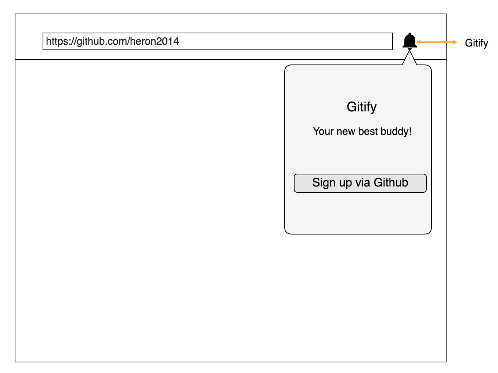

# Coming soon!

## Gitify - new tool that will change every developer life forever!

## What

Gitify is the Chrome extension that organise and summarise your Github issues.

## Why

Working on couple of projects at the same time? Having lots of open issues with different labels? Checking in every couple of hours Github notifications? You know the story...

So, Gitify will tell you all about it under one click!

## Road Map

Version 1:

List of notification build in version 1:
- authentication via Github
- number of labeled issues based on specific repo
- on click redirect the user to specific issue (not sure if this will be done in Version1)

Version 2:
- add organisations repos that you are involved with
- badge which will notify the user of the newly created issue

Version 3:
- milestone deadline notifications

Version 4:
- to be announced soon

Create a website / logo etc.

Write a blog

## Wanna get involved?

- open an issue, create PR
